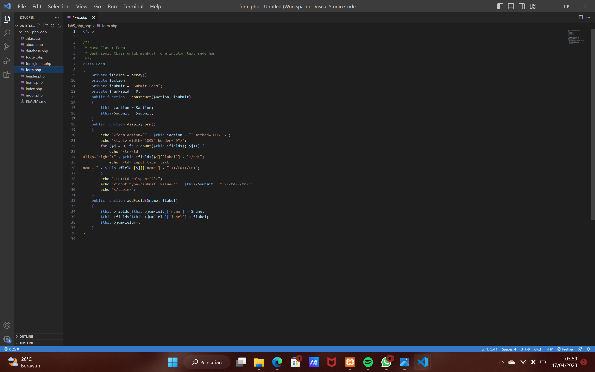

# lab5web
## Profil
| #               | Biodata            |
| --------------- | -----------------  |
| **Nama**        | Anindia Sasikirana |
| **NIM**         | 312110268          |
| **Kelas**       | TI.21.A.2          |
| **Mata Kuliah** | Pemrograman Web 2  |

yang pertama kita harus membuat file mobil.php dahulu 

lalu setelah itu kita membuat file bernama form.php

selanjutnya file bernama form_input.php

lalu tahap terakhir kita membuat file bernama database.php

hasilnya akan menjadi seperti ini 

Terima Kasih
